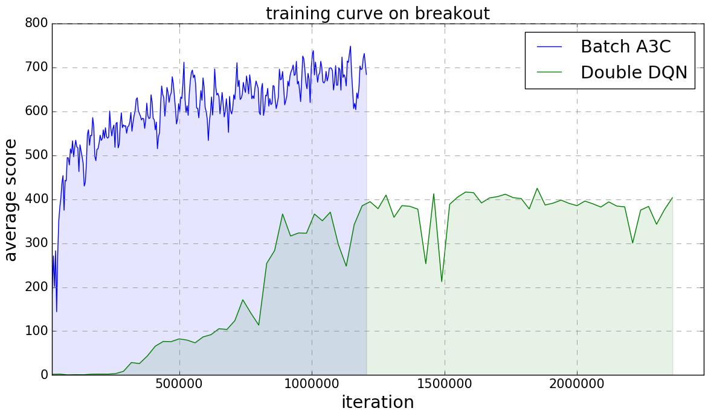

[video demo](https://youtu.be/o21mddZtE5Y)

Reproduce (performance of) the following reinforcement learning methods:

+ Nature-DQN in:
[Human-level Control Through Deep Reinforcement Learning](http://www.nature.com/nature/journal/v518/n7540/full/nature14236.html)

+ Double-DQN in:
[Deep Reinforcement Learning with Double Q-learning](http://arxiv.org/abs/1509.06461)

+ Dueling-DQN in: [Dueling Network Architectures for Deep Reinforcement Learning](https://arxiv.org/abs/1511.06581)

+ A3C in [Asynchronous Methods for Deep Reinforcement Learning](http://arxiv.org/abs/1602.01783). (I
used a modified version where each batch contains transitions from different simulators, which I called "Batch-A3C".)

## Usage:

Install dependencies by `pip install 'gym[atari]'`.

### With ALE (paper's setting):

Download an [atari rom](https://github.com/openai/atari-py/tree/gdb/atari_py/atari_roms), e.g.:
```
wget https://github.com/openai/atari-py/raw/gdb/atari_py/atari_roms/breakout.bin
```

Start Training:
```
./DQN.py --env breakout.bin
# use `--algo` to select other DQN algorithms. See `-h` for more options.
# use '--ntrain' to train the same game in parallel. Output folder change into train_log/DQN-Breakout-ntrain
```

Watch the agent play:
```
# Download pretrained models or use one you trained:
wget http://models.tensorpack.com/DeepQNetwork/DoubleDQN-breakout.bin.npz
./DQN.py --env breakout.bin --task play --load DoubleDQN-breakout.bin.npz
```

Evaluation of 50 episodes:
```
./DQN.py --env breakout.bin --task eval --load DoubleDQN-breakout.bin.npz
```

### With gym's Atari:

Install gym and atari_py. Use `--env BreakoutDeterministic-v4` instead of the ROM file.

## Performance
Claimed performance in the paper can be reproduced, on several games I've tested with.



| Environment    | Avg Score | Download                                                                               |
|:---------------|:---------:|:--------------------------------------------------------------------------------------:|
| breakout.bin   | 465       | [:arrow_down:](http://models.tensorpack.com/DeepQNetwork/DoubleDQN-breakout.bin.npz)   |
| seaquest.bin   | 8686      | [:arrow_down:](http://models.tensorpack.com/DeepQNetwork/DoubleDQN-seaquest.bin.npz)   |
| ms_pacman.bin  | 3323      | [:arrow_down:](http://models.tensorpack.com/DeepQNetwork/DoubleDQN-ms_pacman.bin.npz)  |
| beam_rider.bin | 15835     | [:arrow_down:](http://models.tensorpack.com/DeepQNetwork/DoubleDQN-beam_rider.bin.npz) |

## Speed
On one GTX 1080Ti,
the ALE version took
__~2 hours__ of training to reach 21 (maximum) score on Pong,
__~10 hours__ of training to reach 400 score on Breakout.
It runs at 100 batches (6.4k trained frames, 400 seen frames, 1.6k game frames) per second on GTX 1080Ti.
This is likely the fastest open source TF implementation of DQN.

A3C code and models for Atari games in OpenAI Gym are released in [examples/A3C-Gym](../A3C-Gym)
